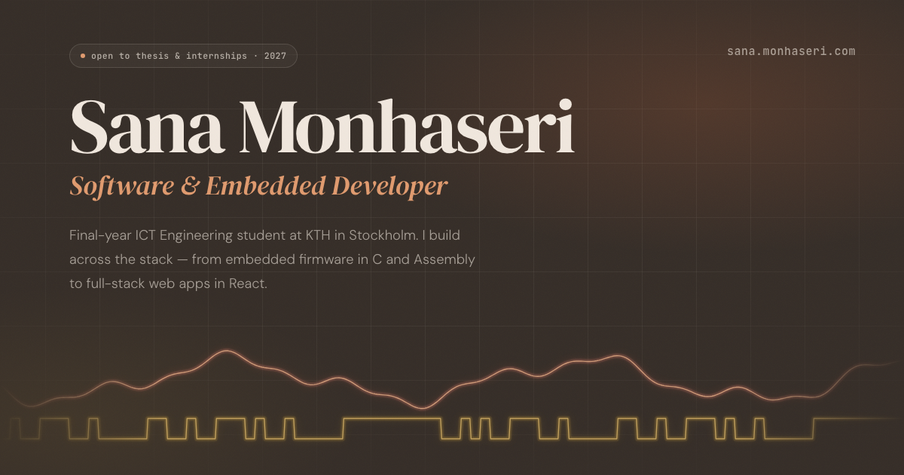

# Sana Monhaseri — Portfolio

Personal portfolio of a final-year ICT Engineering student at KTH, working across embedded firmware and full-stack web development.

**Live:** [sana.monhaseri.com](https://sana.monhaseri.com)



## Highlights

- **Oscilloscope hero:** a canvas-drawn two-channel "scope". CH1 is an analog waveform, and CH2 is a serial bit stream that decodes to `SANA` in 8-bit ASCII. Hovering shows a measurement cursor with live readouts. The animation pauses when off-screen and respects `prefers-reduced-motion`.
- **No UI framework:** React 19 with plain CSS and custom properties. There's no animation library; entrance animations are CSS keyframes.
- **Accessible and fast:** skip link, visible keyboard focus, descriptive alt text, and WCAG AA text contrast. Project images are WebP, and fonts load without blocking rendering.
- **Link previews:** Open Graph and Twitter card metadata, plus JSON-LD `Person` structured data.

## Tech stack

- React 19 (Create React App)
- CSS with custom properties
- Canvas 2D API
- Firebase Hosting

## Project structure

```
portfolio/src/
  Hero/          Hero section, highlights bar, and the oscilloscope canvas (Scope.js)
  About/         Intro, recognition, languages
  Experience/    Formula Student and roles at KTH
  Projects/      Project cards with image slider and "more work" list
  Skills/        Skills table (data in constants/skills.js)
  Footer/        Contact call-to-action and footer
  Navbar/        Fixed navbar with mobile menu
  SocialLinks/   Shared GitHub / LinkedIn / email icon links
  hooks/         useReveal (scroll-reveal via IntersectionObserver)
  constants/     Social links and skills data
  style/         Global styles and design tokens
```

## Running locally

```bash
cd portfolio
npm install
npm start          # http://localhost:3000
```

## Deploying

```bash
cd portfolio
npm run build
firebase deploy --only hosting
```

## License

MIT
